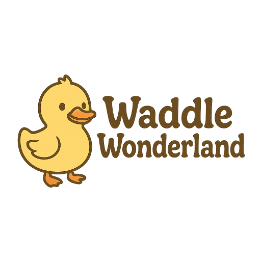

# 🦆 Waddle Wonderland 🦆

  

### Welcome to **Waddle Wonderland**, the ultimate social platform for duck enthusiasts!

Share your favorite quack-tastic moments, connect with fellow duck lovers,  
and dive into a world where every day is a ducky day.

[🦆 Visit Waddle Wonderland 🦆](https://waddle-wonderland.vercel.app)

## 🌟 Features

### 🦆 Duck-Centric Experience

- **Upload duck pictures** - Share your finest duck snaps with the world
- **Edit your ducks** - Made a mistake? No problem! Update your duck posts
- **Infinite nested comments** - Discuss ducks to your heart's content (reply to replies to replies...)
- **Like system** - Show appreciation for the quackiest posts

### 👤 Personal Profile

- **Customizable profile** - Set your duck-tastic profile picture and bio
- **Liked ducks collection** - All your favorite ducks in one place
- **Your duck gallery** - Showcase all the ducks you've shared

### 🎉 Fun Extras

- **Quack-tastic modals** - Enjoy delightful duck sounds with every interaction
- **Playful UI animations** - A joyful experience from head to tail feathers
- **Responsive design** - Waddle on any device!

## 🛠️ Tech Stack

**MERN Stack Powerhouse:**

- **MongoDB** - For storing all our precious duck data
- **Express.js** - Robust backend framework
- **React** - Beautiful, interactive frontend
- **Node.js** - JavaScript runtime environment

**Additional Libraries:**

- Tailwind CSS for styling
- Cloudinary for image storage
- React Icons for delightful icons
- Framer Motion for smooth animations

## 🦆 Contact

[linkedin](https://www.linkedin.com/in/maximilian-pelzer/) - m.pelzer.dev@gmail.com

Project Link: [https://github.com/AlysonRTY/MERN-Project](https://github.com/AlysonRTY/MERN-Project)  
Live Demo: [https://waddle-wonderland.vercel.app](https://waddle-wonderland.vercel.app)

---

**Happy Waddling!** 🦆💛  
May your days be filled with quacks and feathers!
